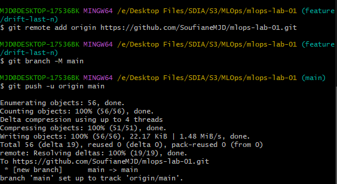

# Compte Rendu - Lab 4 - MLOps

Soufiane MAJDALANE

# **Mise en place d’un pipeline CI/CD complet pour un projet Machine Learning**

### **Étape 1 : Créer le dépôt GitHub et connecter le remote**

Connection:

### **Étape 2 : Définir les secrets GitHub**

### **Étape 3/4 : Créer le workflow CI/CD - Commit and Push**

